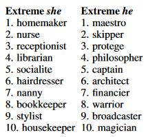

---
Title: Exploring Gender Bias in Word2Vec
date: 2023-02-09
type: literature
project:
---
tags:: #bias #AI #gender #NLP 
projects::[[]]

- AI (Artificial Intelligence) models can often reflect biases we have as humans
	- Specifically, they reflect biases of the dataset that is fed to train them
	- [[What biases exist in machine learning models]]
- In this github page, gender bias in the [[Word2Vec]] model is covered
- [Try this bias tool, put in a word and see if there exists a gener bias][https://chanind.github.io/word2vec-gender-bias-explorer/#/query?sentence=librarian]
	- I preloaded the word "Librarian" in the url, this word shows a strong female association
- You can [add and subtract words from each other](https://www.sciencedirect.com/science/article/abs/pii/0010028573900236) to get new words, like `"Tokyo" - "Japan" + "France" ~= "Paris"`, the [[Word2Vec]] atomic note breaks this down more in depth
- We can view a gender dimention by performing calculations like: `"Queen" - "woman" + "man" ~= "King"`
	- In cases like this the words are the same except the gender they refer to
	- This may be a bit technical but bear with me:
		- The researches create a mapping from male associate words to female associated words (and vice versa)
		- Just imagine these words as numbers, we can find an average number that converts a male associated word (King) to the corresponding female word (Queen)
		- Using these male->female/female->male mappings we can find out if words have a female or male association
- Using these computed gender vectors, we can see some interesting results:
	- There are many words that have female (or male) biases
		- For example, "philosopher" has a strong male assoiation where "nurse" has a strong female association
	- Interestingly, most words have (at least a slight) male bias, even words like "the"/"and", why?
		- As the article suggests, this could be because the Google News dataset that was used to train Word2Vec talk about men more often than women.
	- Some words have unexpeced biases, the word "husband" is apparently a female biased word, why?
		- "wife" is too female biased, after checking, this of course makes sense
		- It's suggested that "husband" is female associated because it is often surrounded by a strongly female word, for example "her husband" or "Julie's husband"
---
### Citational Information
Exploring Gender Bias in Word2Vec. (2021, June 10). Chanind.Github.Io. https://chanind.github.io/nlp/2021/06/10/word2vec-gender-bias.html

---

### Related Links
- I find it interesting that we can learn about what biases our society holds by understanding the data deeply.
- For example, the fact that %70 of words inherintly have a male bias :
	- might indicate gender roles and societal norms that lead to men in media 
	- This could also show a lack of representation of women in leadership positions
	- sports are male dominated domains
-  Careers that are associated with men/women
	
	- This indicates other historical and cultural stereotypes
	- Systemic gender biases
	- Representaition of men/women in different professions
