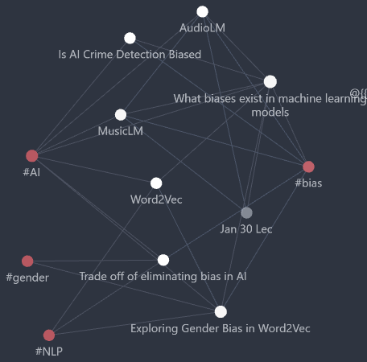

# Exploring bias through the lens of AI
Throughout this exporation I want to cover and ponder the following questions:
- What causes an AI to be biased?
- How do these biases affect the final outcome?
- Is there a trade-off in eliminating biases?

## Entry point
A good entry point into this memex I think is [[Word2Vec]]. This will introduce NLP (Natural Language Processing) and is an entry way into [[Exploring Gender Bias in Word2Vec]], which explains the problems underlying a lot of machine learning models.

## Further reading
After reading those, exploring the **Thoughts** directory would be ideal, with understanding of machine learning and the biases that might underlie it. These thoughts will explain the importance of reducing bias in models as well as why it's not an easy problem to solve.

## Notes
Apologies if I ever get too technical, I am computer science student and love understanding how the AI works. I found that having a deeper understanding of the framework gives me a more complete view of **Bias in AI**.   

  
